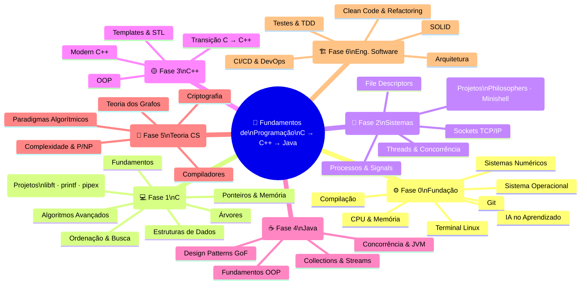

# Roadmap: Fundamentos de Programação

Progressão: **C → C++ → Java** | Inspirado em: 42SP · Akita · IME-USP

Site: https://d00cky.github.io/Programming-Fundamentals/

---

## Mapa Mental

---

## Conteúdo Detalhado por Fase

### ⚙️ Fase 0 — Fundação da Máquina

| Módulo | Tópicos |
|--------|---------|
| [01 — Como o Computador Funciona](fase0-fundacao/01-como-computador-funciona/README.md) | CPU, fetch-decode-execute, registradores, cache |
| [02 — Sistemas Numéricos](fase0-fundacao/02-sistemas-numericos/README.md) | Binário, hex, two's complement, overflow |
| [03 — Sistema Operacional](fase0-fundacao/03-sistema-operacional/README.md) | Processos, memória virtual, syscalls, kernel |
| [04 — Terminal Linux](fase0-fundacao/04-terminal-linux/README.md) | Navegação, pipes, redirecionamento, scripts |
| [05 — Git](fase0-fundacao/05-git/README.md) | Controle de versão, branches, merge, rebase |
| [06 — Compilação](fase0-fundacao/06-compilacao/README.md) | Pré-processador → compilador → assembler → linker |
| [07 — IA no Aprendizado](fase0-fundacao/07-ia-no-aprendizado/README.md) | Vibe Coding, one-shot prompt, mercado de juniors, qual LLM usar, segurança com agentes |

---

### 💻 Fase 1 — C: A Linguagem da Máquina

| Módulo | Tópicos | Projeto |
|--------|---------|---------|
| [01 — Fundamentos](fase1-c/01-fundamentos/README.md) | Tipos, funções, I/O, strings, arrays | Calculadora de Terminal |
| [02 — Ponteiros & Memória](fase1-c/02-ponteiros-memoria/README.md) | malloc, aritmética de ponteiros, Valgrind | Gerenciador de Memória |
| [03 — Estruturas de Dados](fase1-c/03-estruturas-dados/README.md) | Linked list, stack, queue, hash table | Biblioteca de Estruturas |
| [04 — Ordenação & Busca](fase1-c/04-algoritmos-ordenacao/README.md) | Bubble, merge, quick, heap, radix, binary search | Benchmark de Sorts |
| [05 — Árvores](fase1-c/05-arvores/README.md) | BST, AVL, heap, traversals | Agenda com BST |
| [06 — Algoritmos Avançados](fase1-c/06-algoritmos-avancados/README.md) | String matching, backtracking, divide & conquer | Grep Simplificado |

**Projetos da Fase 1:**
[libft](fase1-c/projetos/libft/) · [ft_printf](fase1-c/projetos/ft_printf/) · [get_next_line](fase1-c/projetos/get_next_line/) · [push_swap](fase1-c/projetos/push_swap/) · [minitalk](fase1-c/projetos/minitalk/) · [pipex](fase1-c/projetos/pipex/)

---

### 🔩 Fase 2 — Sistemas

| Módulo | Tópicos | Projeto |
|--------|---------|---------|
| [01 — Processos & Signals](fase2-sistemas/01-processos-sinais/README.md) | fork, exec, wait, signals, zombie | Gerenciador de Processos |
| [02 — File Descriptors](fase2-sistemas/02-file-descriptors/README.md) | open, read, write, dup2, pipes | Mini Shell de Pipes |
| [03 — Threads & Concorrência](fase2-sistemas/03-threads-concorrencia/README.md) | pthreads, mutex, semáforos, race conditions | Produtor-Consumidor |
| [04 — Sockets](fase2-sistemas/04-sockets/README.md) | TCP/IP, cliente/servidor, select, epoll | Chat TCP |

**Projetos da Fase 2:**
[Philosophers](fase2-sistemas/projetos/philosophers/) · [Minishell](fase2-sistemas/projetos/minishell/)

---

### 🟡 Fase 3 — C++

| Módulo | Tópicos | Projeto |
|--------|---------|---------|
| [01 — Transição C → C++](fase3-cpp/01-transicao/README.md) | Classes, RAII, referências, const, namespaces | Refatorar Biblioteca C |
| [02 — OOP](fase3-cpp/02-oop/README.md) | Herança, polimorfismo, virtual, interfaces, abstract | Sistema de Formas |
| [03 — Templates & STL](fase3-cpp/03-stl/README.md) | vector, map, set, iterators, algorithms, functors | Container Genérico |
| [04 — Modern C++](fase3-cpp/04-modern-cpp/README.md) | Smart pointers, lambdas, move semantics, ranges | Reimplementar Containers |

---

### ☕ Fase 4 — Java

| Módulo | Tópicos | Projeto |
|--------|---------|---------|
| [01 — Fundamentos](fase4-java/01-fundamentos/README.md) | OOP, generics, exceptions, I/O, Optional | Biblioteca de Coleções |
| [02 — Collections & Streams](fase4-java/02-collections-streams/README.md) | ArrayList, HashMap, TreeMap, Stream API, lambdas | Pipeline de Dados |
| [03 — Concorrência](fase4-java/03-concorrencia/README.md) | Threads, Executor, CompletableFuture, synchronized | Servidor Concorrente |
| [04 — JVM & Performance](fase4-java/04-jvm/README.md) | ClassLoader, JIT, GC, profiling, memory model | Benchmark JVM |
| [05 — Design Patterns](fase4-java/05-design-patterns/README.md) | GoF: Creational, Structural, Behavioral | Framework com Patterns |

---

### 🧠 Fase 5 — Teoria CS

| Módulo | Tópicos | Projeto |
|--------|---------|---------|
| [01 — Complexidade](fase5-teoria-cs/01-complexidade/README.md) | Big-O, Teorema Mestre, P/NP, análise amortizada | Benchmark de Algoritmos |
| [02 — Paradigmas](fase5-teoria-cs/02-paradigmas/README.md) | Divide & Conquer, DP, Greedy, Backtracking | Knapsack · Scheduling · N-Rainhas |
| [03 — Grafos](fase5-teoria-cs/03-grafos/README.md) | BFS, DFS, Dijkstra, Bellman-Ford, Kruskal, Prim, SCC | Sistema de Mapa de Cidades |
| [04 — Compiladores](fase5-teoria-cs/04-compiladores/README.md) | Tokens, parsing, AST, análise semântica, otimizações | Mini Calculadora com Parser |
| [05 — Criptografia](fase5-teoria-cs/05-criptografia/README.md) | Hashing, AES, RSA, DH, TLS, libsodium | Ferramenta de Cifração |

---

### 🏗️ Fase 6 — Engenharia de Software

| Módulo | Tópicos | Projeto |
|--------|---------|---------|
| [01 — SOLID](fase6-eng-software/01-solid/README.md) | SRP, OCP, LSP, ISP, DIP com exemplos Java | Sistema E-Commerce |
| [02 — Clean Code](fase6-eng-software/02-clean-code/README.md) | Nomes, funções, code smells, refactorings de Fowler | Refatoração de Legado |
| [03 — Testes](fase6-eng-software/03-testes/README.md) | JUnit 5, TDD, Mockito, JaCoCo, pirâmide de testes | Stack com TDD |
| [04 — Arquitetura](fase6-eng-software/04-arquitetura/README.md) | Layered, Clean Arch, Hexagonal, DDD, Microservices | Arquitetura E-Commerce |
| [05 — CI/CD](fase6-eng-software/05-cicd/README.md) | GitHub Actions, Docker, docker-compose, observabilidade | Pipeline Completo Java |

---

## Livros de Referência

| Livro | Fase |
|-------|------|
| The C Programming Language — K&R | Fase 1 |
| C Programming: A Modern Approach — K.N. King | Fase 1 |
| Operating Systems: Three Easy Pieces — Arpaci-Dusseau | Fase 2 |
| The C++ Programming Language — Stroustrup | Fase 3 |
| Effective C++ — Scott Meyers | Fase 3 |
| Introduction to Algorithms (CLRS) — Cormen et al. | Fase 1–5 |
| Effective Java — Joshua Bloch | Fase 4 |
| Design Patterns — GoF | Fase 4–6 |
| Clean Code — Robert C. Martin | Fase 6 |
| Clean Architecture — Robert C. Martin | Fase 6 |
| The Pragmatic Programmer — Hunt & Thomas | Fase 6 |

## Materiais Online

- **IME-USP Algoritmos** — ime.usp.br/~pf/algorithms
- **CS50x** — cs50.harvard.edu (gratuito)
- **OSTEP** — ostep.org (OS: Three Easy Pieces, gratuito)
- **Crafting Interpreters** — craftinginterpreters.com (gratuito)
- **Akitando** — YouTube: séries "Começando aos 40", episódios #80, #38, #37
- **nand2tetris** — nand2tetris.org (construa um computador do zero)
- **Godbolt** — godbolt.org (veja o assembly gerado pelo seu C em tempo real)
