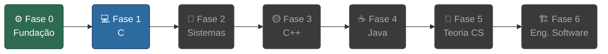

# Programming Fundamentals

Roadmap de estudo focado em construir uma base sólida de Engenharia de Software, com progressão **C → C++ → Java**. Inspirado na metodologia da 42SP, filosofia do Akita e currículo da IME-USP.

---

---

## Índice

| Fase | Descrição | Conteúdo |
|------|-----------|----------|
| [⚙️ Fase 0](fase0-fundacao/README.md) | **Fundação da Máquina** — Como tudo funciona antes de escrever uma linha de C | CPU, memória, binário, terminal, git, compilação |
| [💻 Fase 1](fase1-c/README.md) | **C: A Linguagem da Máquina** — Ponteiros, memória, estruturas de dados, algoritmos | libft, ft_printf, push_swap, pipex |
| [🔩 Fase 2](fase2-sistemas/README.md) | **Sistemas** — Processos, threads, sockets no nível do SO | Philosophers, Minishell |
| [🟡 Fase 3](fase3-cpp/README.md) | **C++** — OOP, templates, STL, Modern C++ | Módulos 42, CPP Containers |
| [☕ Fase 4](fase4-java/README.md) | **Java** — OOP empresarial, JVM, design patterns | CRUD, projetos concorrentes |
| [🧠 Fase 5](fase5-teoria-cs/README.md) | **Teoria CS** — Grafos, DP, complexidade computacional | — |
| [🏗️ Fase 6](fase6-eng-software/README.md) | **Engenharia de Software** — SOLID, Clean Code, testes, arquitetura | — |

Para o mapa visual completo com todos os tópicos de cada fase: [roadmap.md](roadmap.md)
