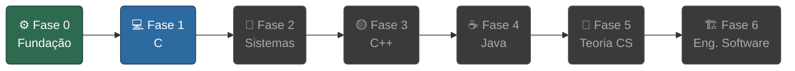

# Programming Fundamentals

Repositório de estudo de fundamentos de programação com progressão **C → C++ → Java**.
Inspirado na metodologia da 42SP, filosofia do Akita e currículo da IME-USP.

Cada módulo segue a estrutura [Odin Project](https://www.theodinproject.com/): pré-requisitos, objetivos de aprendizado, conteúdo, knowledge check, projeto integrador e recursos adicionais.

---



## Mapa Interativo

O arquivo [`galaxy.html`](galaxy.html) é um mapa visual estilo "Holy Graph" (42SP) com todas as fases e módulos do currículo.

**Abrir localmente (Linux):**
```bash
xdg-open galaxy.html
```

**Online:** https://d00cky.github.io/Programming-Fundamentals/galaxy.html

---

## Fases

| Fase | Descrição | Módulos | Projetos |
|------|-----------|---------|----------|
| [⚙️ Fase 0](fase0-fundacao/README.md) | **Fundação** — Como a máquina funciona antes de escrever C | CPU, binário, SO, terminal, git, compilação | — |
| [💻 Fase 1](fase1-c/README.md) | **C** — A linguagem da máquina | Fundamentos, ponteiros, estruturas de dados, algoritmos | libft · ft_printf · get_next_line · push_swap · minitalk · pipex |
| [🔩 Fase 2](fase2-sistemas/README.md) | **Sistemas** — O que o SO oferece ao programador | Processos, file descriptors, threads, sockets | Philosophers · Minishell |
| [🟡 Fase 3](fase3-cpp/README.md) | **C++** — OOP, templates e a STL | Transição, OOP, STL, Modern C++ | Módulos 00–09 · CPP Containers |
| [☕ Fase 4](fase4-java/README.md) | **Java** — OOP empresarial e a JVM | Fundamentos, collections, concorrência, JVM, patterns | CRUD · Projeto concorrente |
| [🧠 Fase 5](fase5-teoria-cs/README.md) | **Teoria CS** — Algoritmos e teoria por trás do código | Complexidade, paradigmas, grafos, compiladores, criptografia | — |
| [🏗️ Fase 6](fase6-eng-software/README.md) | **Engenharia de Software** — Código que dura | SOLID, clean code, testes, arquitetura, CI/CD | — |

Para o mapa visual completo com todos os tópicos: [roadmap.md](roadmap.md)
