# Roadmap: Fundamentos de Programação

Progressão: **C → C++ → Java** | Inspirado em: 42SP · Akita · IME-USP

---

## Mapa Visual

```mermaid
flowchart TD
    subgraph FASE0["⚙️ FASE 0 — Fundação da Máquina"]
        direction TB
        n01["CPU & Memória\n(fetch-decode-execute)"] --> n02["Sistemas Numéricos\n(binário, hex, two's complement)"] --> n03["Sistema Operacional\n(processos, memória virtual, syscalls)"] --> n04["Terminal Linux\n(navegação, pipes, redirecionamento)"] --> n05["Git\n(controle de versão desde o início)"] --> n06["Compilação\n(pré-proc → compilador → assembler → linker)"]
    end

    subgraph FASE1["💻 FASE 1 — C: A Linguagem da Máquina"]
        direction TB
        n11["1.1 Fundamentos\n(tipos, funções, I/O, strings)"] --> n12["1.2 Ponteiros & Memória\n(malloc, aritmética, Valgrind)"] --> n13["1.3 Estruturas de Dados\n(linked list, stack, queue, hash table)"] --> n14["1.4 Ordenação & Busca\n(bubble, merge, quick, heap, radix, binary search)"] --> n15["1.5 Árvores\n(BST, AVL, heap, traversals)"] --> n16["1.6 Algoritmos Avançados\n(string matching, backtracking, recursão)"] --> n17["1.7 Tooling\n(Makefile, GDB, Valgrind, norma)"]
        n17 --> n1p["🛠️ Projetos\nlibft · ft_printf · get_next_line\npush_swap · minitalk · pipex"]
    end

    subgraph FASE2["🔩 FASE 2 — Sistemas"]
        direction TB
        n21["Processos\n(fork, exec, wait, signals)"] --> n22["File Descriptors\n(open, read, write, dup2)"] --> n23["Threads & Concorrência\n(pthreads, mutex, semáforos)"] --> n24["Sockets\n(TCP/IP, cliente/servidor)"]
        n24 --> n2p["🛠️ Projetos\nPhilosophers · Minishell"]
    end

    subgraph FASE3["🟡 FASE 3 — C++"]
        direction TB
        n31["3.1 Transição C → C++\n(classes, RAII, referências, const)"] --> n32["3.2 OOP\n(herança, polimorfismo, virtual, interfaces)"] --> n33["3.3 Templates & STL\n(vector, map, set, iterators, algorithms)"] --> n34["3.4 Modern C++\n(smart pointers, lambdas, move semantics)"]
        n34 --> n3p["🛠️ Projetos\nMódulos 00–09 · CPP Containers"]
    end

    subgraph FASE4["☕ FASE 4 — Java"]
        direction TB
        n41["4.1 Fundamentos\n(OOP, generics, exceptions, I/O)"] --> n42["4.2 Collections\n(ArrayList, HashMap, TreeMap, HashSet)"] --> n43["4.3 Concorrência & Streams\n(threads, executor, Streams API, lambdas)"] --> n44["4.4 JVM & Performance\n(classloader, JIT, GC, profiling)"] --> n45["4.5 Design Patterns\n(GoF: creational, structural, behavioral)"]
        n45 --> n4p["🛠️ Projetos\nDS do zero · CRUD com patterns · Concorrente"]
    end

    subgraph FASE5["🧠 FASE 5 — Teoria CS"]
        direction TB
        n51["Complexidade\n(P, NP, NP-completo, Big-O)"] --> n52["Paradigmas\n(Divide & Conquer, DP, Greedy, Backtracking)"] --> n53["Grafos\n(BFS, DFS, Dijkstra, Bellman-Ford, Kruskal, Prim)"] --> n54["Compiladores\n(tokens, parsing, AST)"] --> n55["Criptografia\n(hashing, simétrica, assimétrica)"]
    end

    subgraph FASE6["🏗️ FASE 6 — Engenharia de Software"]
        direction TB
        n61["SOLID Principles"] --> n62["Clean Code & Refactoring"] --> n63["Testes\n(unit, integration, TDD)"] --> n64["Arquitetura\n(layered, hexagonal, microservices)"] --> n65["CI/CD\n(pipelines, automação)"]
    end

    FASE0 --> FASE1
    FASE1 --> FASE2
    FASE2 --> FASE3
    FASE3 --> FASE4
    FASE4 --> FASE5
    FASE5 --> FASE6
```

---

## Conteúdo Detalhado por Fase

### Fase 0 — Fundação da Máquina
| Tópico | Guia |
|--------|------|
| Como o Computador Funciona | [01-como-computador-funciona](fase0-fundacao/01-como-computador-funciona/README.md) |
| Sistemas Numéricos | [02-sistemas-numericos](fase0-fundacao/02-sistemas-numericos/README.md) |
| Sistema Operacional | [03-sistema-operacional](fase0-fundacao/03-sistema-operacional/README.md) |
| Terminal Linux | [04-terminal-linux](fase0-fundacao/04-terminal-linux/README.md) |
| Git | [05-git](fase0-fundacao/05-git/README.md) |
| Compilação | [06-compilacao](fase0-fundacao/06-compilacao/README.md) |

### Fase 1 — C: A Linguagem da Máquina
| Módulo | Projetos |
|--------|----------|
| 1.1 Fundamentos | — |
| 1.2 Ponteiros & Memória | — |
| 1.3 Estruturas de Dados | — |
| 1.4 Ordenação & Busca | — |
| 1.5 Árvores | — |
| 1.6 Algoritmos Avançados | — |
| 1.7 Tooling (Makefile, GDB, Valgrind) | — |
| **Projetos** | [libft](fase1-c/projetos/libft/) · [ft_printf](fase1-c/projetos/ft_printf/) · [get_next_line](fase1-c/projetos/get_next_line/) · [push_swap](fase1-c/projetos/push_swap/) · [minitalk](fase1-c/projetos/minitalk/) · [pipex](fase1-c/projetos/pipex/) |

### Fase 2 — Sistemas
| Módulo | Projetos |
|--------|----------|
| Processos (fork, exec, signals) | — |
| File Descriptors | — |
| Threads & Concorrência | — |
| Sockets (TCP/IP) | — |
| **Projetos** | [Philosophers](fase2-sistemas/projetos/philosophers/) · [Minishell](fase2-sistemas/projetos/minishell/) |

### Fase 3 — C++
| Módulo | Projetos |
|--------|----------|
| 3.1 Transição C → C++ (RAII, referências) | — |
| 3.2 OOP (herança, polimorfismo, interfaces) | — |
| 3.3 Templates & STL | — |
| 3.4 Modern C++11/14/17 | — |
| **Projetos** | [Módulos 00–09](fase3-cpp/projetos/) · CPP Containers |

### Fase 4 — Java
| Módulo | Projetos |
|--------|----------|
| 4.1 Fundamentos (OOP, generics, exceptions) | — |
| 4.2 Collections Framework | — |
| 4.3 Concorrência & Streams API | — |
| 4.4 JVM & Performance | — |
| 4.5 Design Patterns (GoF) | — |
| **Projetos** | DS do zero · CRUD com patterns · Projeto concorrente |

### Fase 5 — Teoria CS
- Complexidade: P, NP, NP-completo
- Paradigmas: Divide & Conquer, Dynamic Programming, Greedy, Backtracking
- Grafos: BFS, DFS, Dijkstra, Bellman-Ford, Floyd-Warshall, Kruskal, Prim
- Compiladores: tokens, parsing, AST
- Criptografia: hashing, simétrica/assimétrica

### Fase 6 — Engenharia de Software
- SOLID, Clean Code, Refactoring
- Testes: unit, integration, TDD
- Arquitetura: layered, hexagonal, microservices (visão geral)
- CI/CD básico

---

## Livros de Referência

| Livro | Fase |
|-------|------|
| The C Programming Language — K&R | Fase 1 |
| C Programming: A Modern Approach — K.N. King | Fase 1 |
| Introduction to Algorithms (CLRS) — Cormen et al. | Fase 1–5 |
| Algorithms — Sedgewick & Wayne | Fase 1–5 |
| The C++ Programming Language — Stroustrup | Fase 3 |
| Effective C++ — Scott Meyers | Fase 3 |
| Effective Java — Joshua Bloch | Fase 4 |
| Design Patterns — GoF | Fase 4–6 |
| Clean Code — Robert C. Martin | Fase 6 |
| The Pragmatic Programmer — Hunt & Thomas | Fase 6 |
| Operating Systems: Three Easy Pieces — Arpaci-Dusseau | Fase 2 |

## Materiais Online

- **IME-USP Algoritmos** — ime.usp.br/~pf/algorithms
- **CS50x** — cs50.harvard.edu (gratuito)
- **OSTEP** — ostep.org (OS: Three Easy Pieces, gratuito)
- **Akitando** — YouTube: séries "Começando aos 40", episódios #80, #38, #37
- **nand2tetris** — nand2tetris.org (construa um computador do zero)
- **Godbolt** — godbolt.org (veja o assembly gerado pelo seu C em tempo real)
